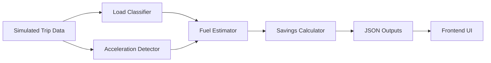
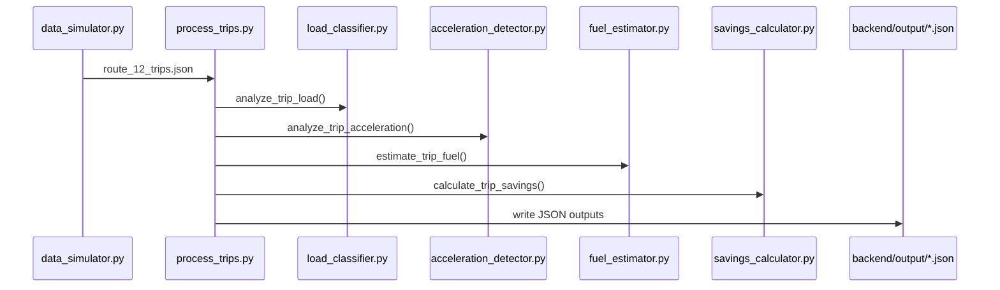
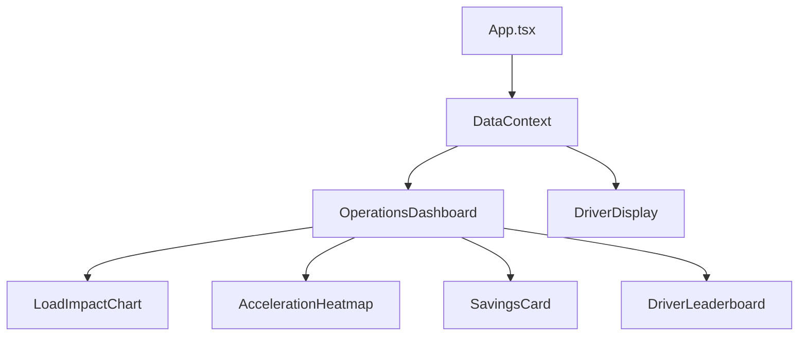

# Architecture

## System overview
ProjectBus is split into two major subsystems:
- Backend pipeline (Python) generates analytics JSON from simulated trip data.
- Frontend UI (React) reads JSON and renders analytics and driver guidance.

The system is intentionally file based: JSON outputs are written to `backend/output/` and copied into `frontend/public/data/` for the UI.

## High-level flow

## Components

### Backend
- `backend/pipeline/data_simulator.py` generates realistic Route 12 trip inputs.
- `backend/pipeline/process_trips.py` orchestrates the four algorithms, aggregates stats, and writes JSON outputs.
- `backend/algorithms/` contains the four algorithms:
  - Load classifier
  - Acceleration detector
  - Fuel estimator
  - Savings calculator

### Frontend
- `frontend/src/App.tsx` selects the UI mode (Operations vs Driver) and demo scenario.
- `frontend/src/context/DataContext.tsx` loads JSON from `/data/*.json` and exposes it via React context.
- `frontend/src/components/*` renders the dashboard, charts, and driver guidance panels.

## Data contracts (summary)
The frontend expects specific JSON shapes. These are produced by `backend/pipeline/process_trips.py`.
- `fleet_weekly_stats.json` (fleet aggregates)
- `scenario_light_load.json`
- `scenario_heavy_optimal.json`
- `scenario_heavy_wasteful.json`
- `all_trips_processed.json` (full trip list)

Details are in `docs/DATA.md`.

## Diagram: Pipeline sequence

## Diagram: Frontend data flow

## Design notes and constraints
- The frontend is a prototype and uses mock/static JSON, not a live API.
- Scenario switching is a demo feature driven by `scenarioType` in `DataContext`.
- Backend algorithms are deterministic and are written for clarity rather than performance.

